# **WEEK 1**

## **PART 1 前言**

本文档分为 **前言 工具部署 知识总结 靶场联系** 四个部分

## **PART 2 工具部署**

大部分的工具可以在github上获取 少部分需要去官网 或者通过论坛等渠道获取

不得不说 [探姬师傅的网站](https://hello-ctf.com/sidebar/tools.html) 确实让这个过程方便不少

编程工具

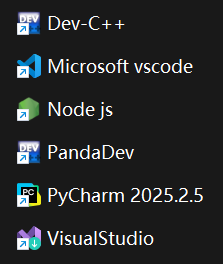

misc工具

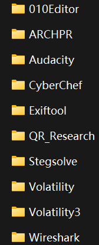

## **PART 3 知识总结**

这个部分实际上是在完成 **靶场练习** 之后才写的  
作用是总结 **靶场练习** 中涉及到的知识点

### **PART 3.1 工具用途**

由于仅涉猎靶场练习中遇到的知识点 所以记录并不全面

| 软件      | 用途                     |
| --------- | ------------------------ |
| 010Editor | 查看并编辑文件的十六进制 |
| Stegsolve | 逐帧查看gif文件          |

### **PART 3.2 文件结构**

由于靶场仅涉猎到png文件 所以这里只记录png文件的结构

PNG 文件格式设计时就统一采用大端序（网络字节序）  
因为它的设计目标是跨平台一致 而TCP/IP 网络协议栈也采用大端序  
这样任何机器读取 PNG 文件时，字节顺序都是固定可预测的

> 大端序 和 小端序 的区别  
> 假设数据为 `800`（十进制） 用十六进制就是`0x00000320`  
> 大端序表示为 `00 00 03 20`  
> 小端序表示为 `20 03 00 00`

一个png文件由 **一个sig 多个数据块chunk** 构成  
其中sig为 **固定的8位十六进制数** 用于标识这是一个png文件  
`89 50 4E 47 0D 0A 1A 0A` 即 `‰PNG

`  
而每个 chunk 都由四个部分组成

| 部分       | 大小（字节） | 内容                                              |
| ---------- | ------------ | ------------------------------------------------- |
| Length     | 4            | 数据字段的大小（只包含Chunk Data）                |
| Chunk Type | 4            | 块类型（比如 IHDR IDAT）                          |
| Chunk Data | 非固定       | 实际数据内容                                      |
| CRC        | 4            | 循环冗余校验码（对 Chunk Type + Chunk Data 计算） |

数据块中 有必然存在的 **关键数据块** 与 可能存在的 **辅助数据块**

#### **PART 3.2.1 关键数据块**

有 `IHDR(Image Header)` `PLTE(Palette)` `IDAT(Image Data)` `IEND(Image End)`

IHER

- 位置：`89 50 4E 47 0D 0A 1A 0A`之后
- 长度：13字节
- 内容：
  - Width（4字节）：图像宽度
  - Height（4字节）：图像高度
  - Bit depth（1字节）：颜色深度
  - Color type（1字节）：颜色类型
    - 0 -> 灰度
    - 2 -> 真彩色
    - 3 -> 索引色
    - 4 -> 灰度+Alpha
    - 6 -> 真彩色+Alpha
  - Compression method（1字节）：压缩方法
    - 目前只有 0 -> deflate/inflate
  - Filter method（1字节）：滤波方法
    - 目前只有 0
  - Interlace method（1字节）：隔行扫描方式
    - 0 -> 非隔行
    - 1 -> Adam7 隔行

PLTE（可选）

- 当 IHER 中的 Color type 为 3（索引色）时必须
- 包含RGB调色板条目（每项3字节）

IDAT

- 存在一个或多个 且多个时 必定连续出现
- 存储经过 滤波 和 deflate 压缩后的像素数据
- 所有 IDAT 块的数据拼接后解压得到原始扫描行数据

IEND

- 位置：最后
- 长度：0
- 作用：标志png文件结束

#### **PART 3.2.2 辅助数据块**

提供额外的信息 解码器可选择忽略

| 辅助数据块     | 内容                                                    |
| -------------- | ------------------------------------------------------- |
| tRNS           | 透明度（用于 灰度 真彩色 调色板图像 的 Alpha 通道替代） |
| gAMA           | 伽马校正信息                                            |
| cHRM           | 主色度坐标                                              |
| sRGB           | 标准 RGB 色彩空间                                       |
| iCCP           | 嵌入 ICC 色彩配置文件                                   |
| tEXt/zTXt/iTXt | 文本信息                                                |
| bKGD           | 背景色建议                                              |
| pHYs           | 物理像素尺寸（用于打印 DPI）                            |
| tIME           | 图像最后修改时间                                        |

#### **PART 3.2.3 CRC报错**

CRC（循环冗余校验）可以当作数据的指纹  
通过CRC-32算法 会计算出4字节大小的CRC校验码  
而计算校验码的涉及到的参数有 **Chunk Type** 与 **Chunk Data**

也就是说 如果修改了这两个数据 而不跟着修改CRC校验码 用修改后的参数算出的数值与实际文件中的数值对不上 就会出现CRC报错

在misc中有一类题型通过修改文件的宽高数据来让文件显示不全  
而修改宽高的数据 就会改变 **IHDR** 类型数据块中 **Chunk Data** 的值 导致算出的CRC校验码与文件中实际写的CRC校验码不等 产生CRC报错

也就是说 如果题目有改变图片宽高的迹象 我们可以通过查看有无CRC报错来验证猜想

由于算法是固定的 如果我们需要获取原图片正常的宽高 可以通过编写脚本来实现 这里使用的是 **Python**

```
"""
图片宽高真实值计算
"""
# 导入关键库
import zlib # Python 自带的标准库 封装了CRC-32的计算函数
import struct # 把 Python 的整数打包成二进制字节串（比如 x00\x00\x03\x20）

# 设置真实CRC校验值
true_crc = 数值

# 已知条件（一般宽和高其中一个是正确的 因为如果两个都改 图片就花了 哪个正确填哪个就行 这里以宽正确为例）
width = 数值
depth = 数值
type = 数值
compression = 0
filter = 0
interlace = 数值

# 爆破
# 在0到4000像素的范围中爆破真实高度 如果没爆出来可以试试再把范围调大点
for height in range(0, 4000):
    """
    将数据打包成二进制字节串
    '>IIBBBBB'中
    > 代表大端序
    I 4字节 这里对应 图片宽度/Width
    I 4字节 这里对应 图片高度/Height
    B 1字节 这里对应 颜色深度/Bit depth
    B 1字节 这里对应 颜色类型/Color type
    B 1字节 这里对应 压缩方法/Compression method
    B 1字节 这里对应 滤波方法/Filter method
    B 1字节 这里对应 隔行扫描方式/Interlace method
    """
    data = struct.pack('>IIBBBBB', width, height, depth, type, compression, filter, interlace)

    # 计算crc校验值
    crc = zlib.crc32(b'IHDR' + data) & 0xffffffff

    # 如果值等于真实的CRC校验值 说明高度正确
    # 输出真正的高度 并结束循环
    if crc == true_crc:
        print(f"图片真正的宽度和高度分别是：{width} 与 {height}")
        break
```

## **PART 4 靶场练习**

### **PART 4.1 find_me**

**题目描述**：树师傅在自己最喜欢的照片里藏了flag，你能找出来吗？ 顺便一提，树师傅最喜欢的16进制编辑器是010Editor。  
**工具**：010Editor

拿到附件 解压 发现是一张png图片

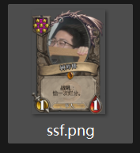

根据题目描述 这题的flag需要使用到 **010Editor**  
那么用010打开文件

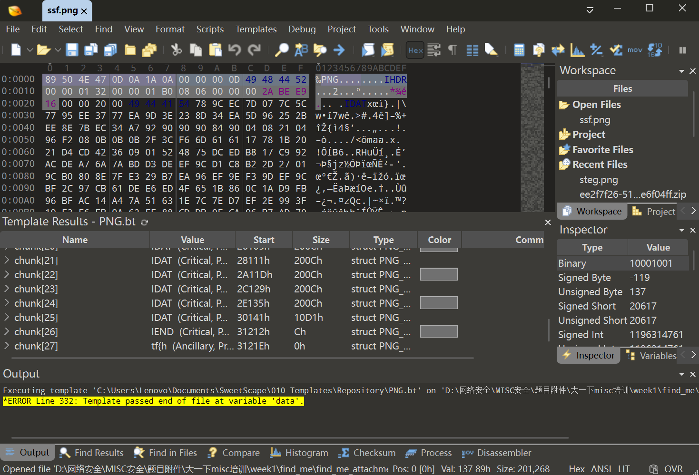

我们发现 在PNG文件结束符 `IEND` 后还有一个数据块  
看起来符号flag的格式

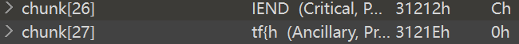

找到这个数据块

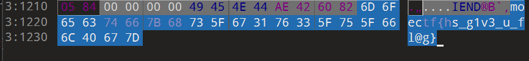

发现就是flag 复制 取得flag flag为  
`moectf{hs_g1v3_u_fl@g}`

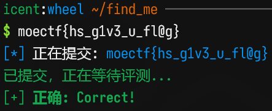

### **PART 4.2 金三胖**

**题目描述**：注意：得到的 flag 请包上 flag{} 提交  
**工具**：Stegsolve

拿到附件 解压 发现是一张gif图片

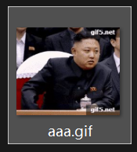

播放看看 发现闪烁了几个红底字幕 我们需要知道它的内容  
既然要逐帧读取gif文件 就选用 **Stegsolve**

用 **Stegsolve** 打开文件

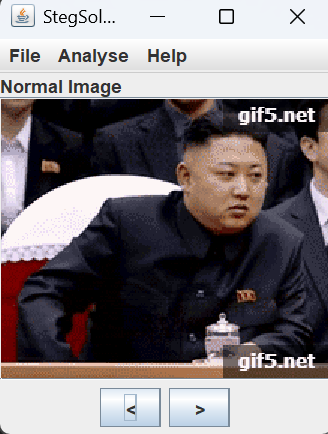

点击 `Analyse` 再点击 `Frame Browser` 可以逐帧查看图片

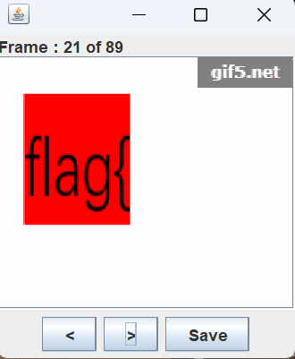

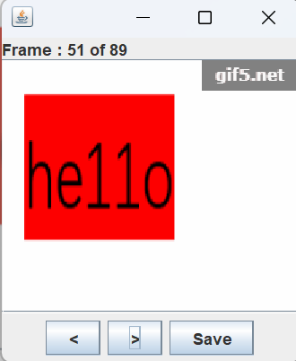

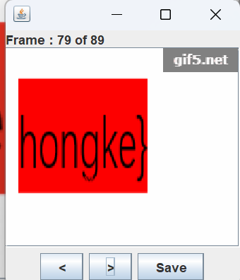

动图的 21 51 79 帧的内容就是flag  
拼接 取得flag flag为  
`flag{he11ohongke}`

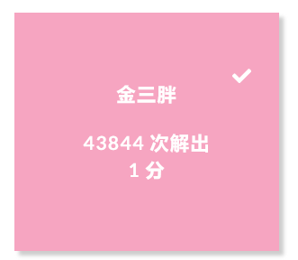

### **PART 4.3 大白**

**题目描述**：看不到图？ 是不是屏幕太小了 注意：得到的 flag 请包上 flag{} 提交  
**工具**：010Editor

拿到附件 解压 发现是一张png图片

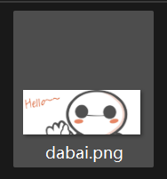

根据题目描述 合理猜测可能是宽高被动了手脚 导致图片显示不全 要检查宽高 就要看看有没有 **CRC报错**  
那就用 **010Editor** 检查一下

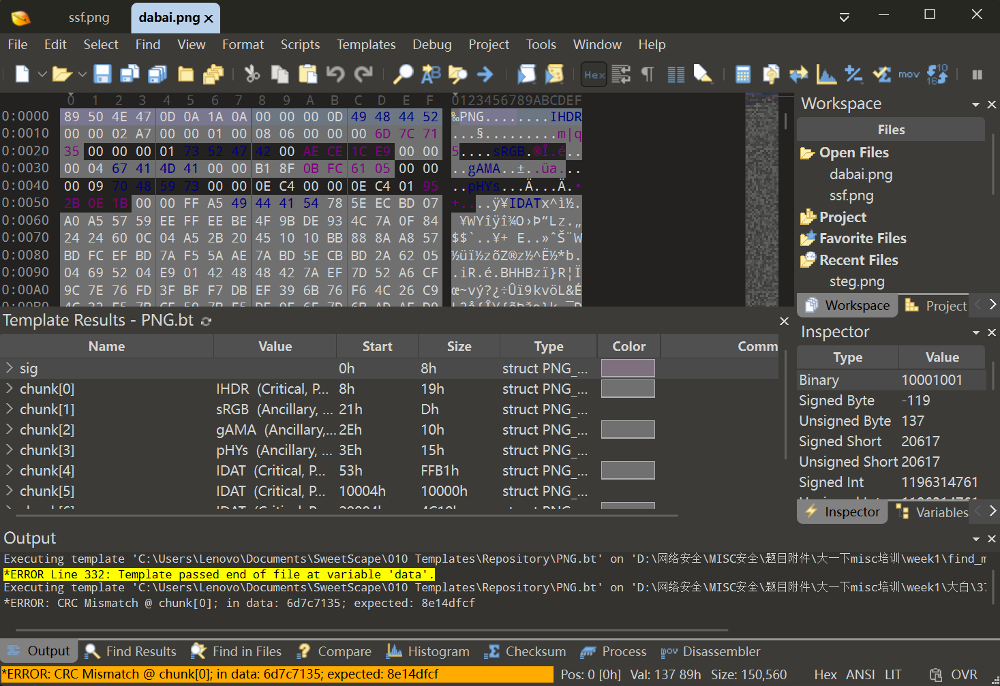

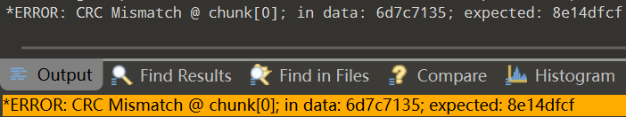

确实有 CRC报错 那么就看看宽高的位置  
即PNG文件头部 `IHED` 后的8个16进制数 前4个为宽 后4个为高

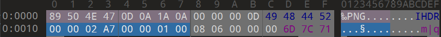

发现宽为 `00 00 02 A7` 而高只有 `00 00 01 00`  
给高调大点 这里也改成 `00 00 02 A7`

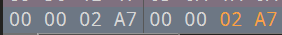

`Ctrl+s` 保存 再次打开图片


发现先前未显示出来的flag 记下来 取得flag flag为  
`flag{He1l0_d4_ba1}`

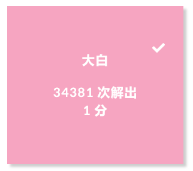

### **PART 4.4 寻找黑客的家**

**题目描述**：大黑客Mikato期末结束就迫不及待的回了家，并在朋友圈发出了“这次我最早”的感叹。那么你能从这条朋友圈找到他的位置吗？

moectf{照片拍摄地市名区名路名} (字母均小写) 例如：西安市长安区西沣路：moectf{xian_changan_xifeng}  
**工具**：任意具有识图能力的AI(这里用的 豆包 )

拿到附件 解压 发现里面是一张png图片和一张jpg图片

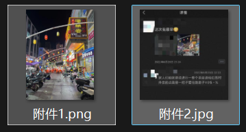

打开看看

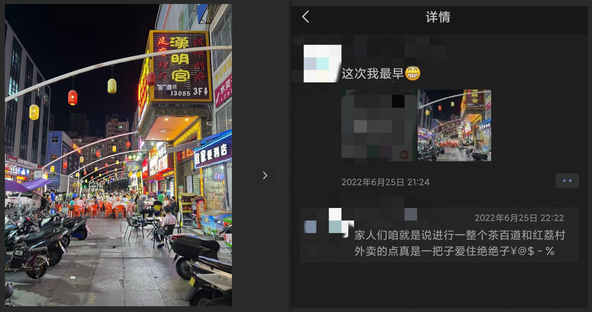

根据题目描述和附件内容 这道应该是社工题  
先看看图片的属性有没有什么信息

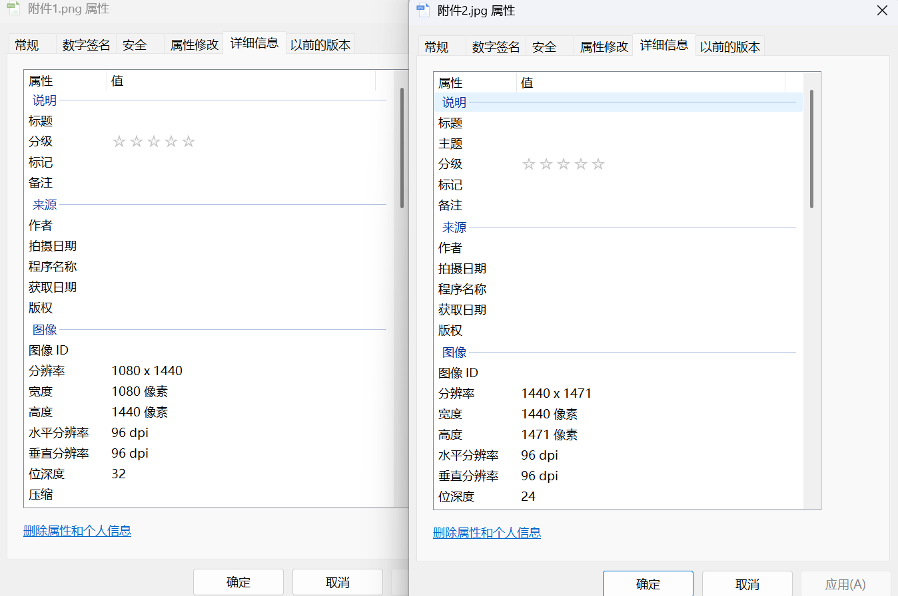

好 空空如也 那只能根据图片内容了  
把附件1喂给 **豆包** 获取一个大概的位置

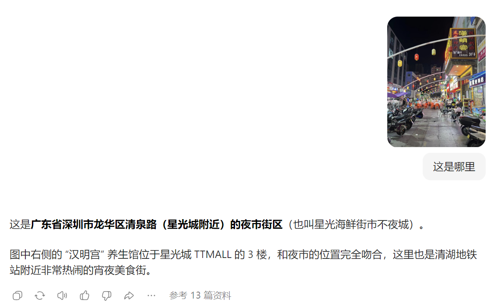

额 好像答案一步到位了 其实应该是要通过第一张图确定大致位置 第二张图缩小范围来着 但是出都出来了 那没办法了  
AI还是太超模了

取得flag flag为  
`moectf{shenzhen_longhua_qingquan}`

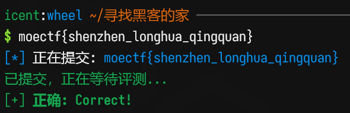
