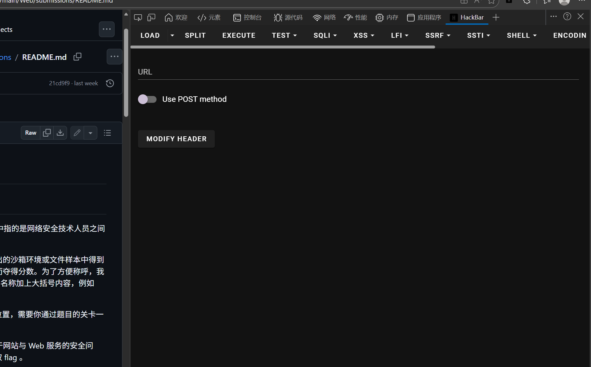
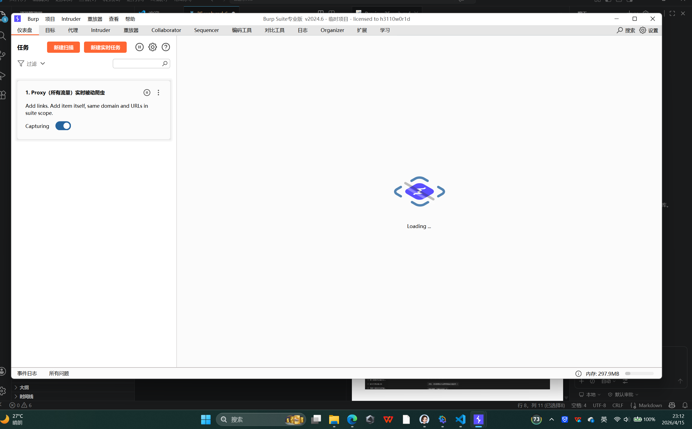
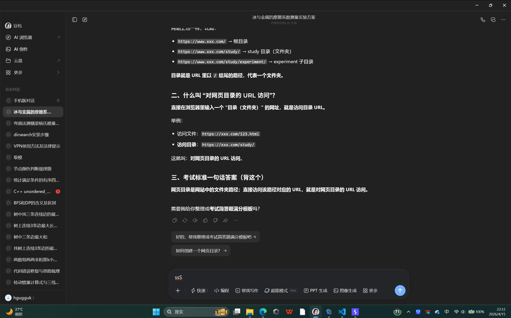
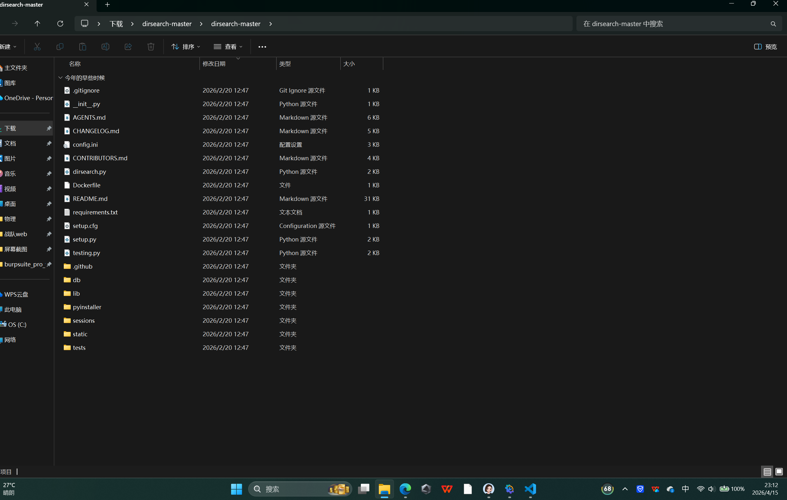
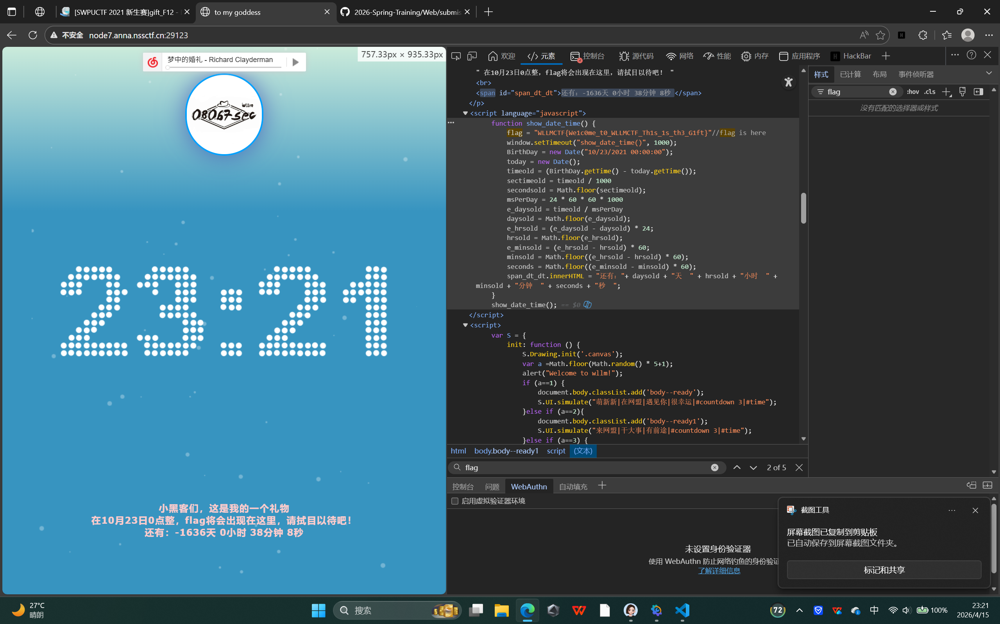
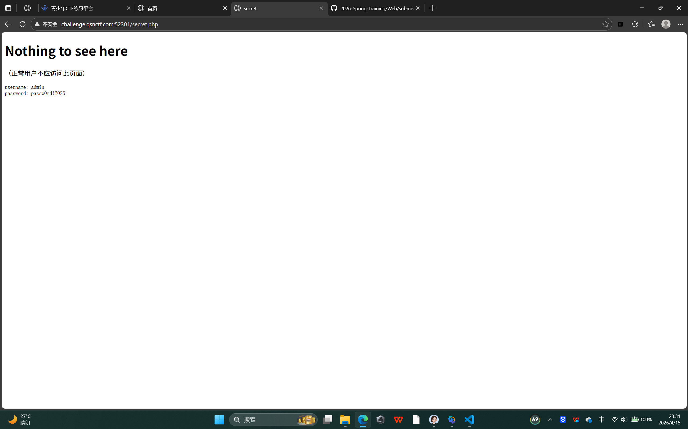
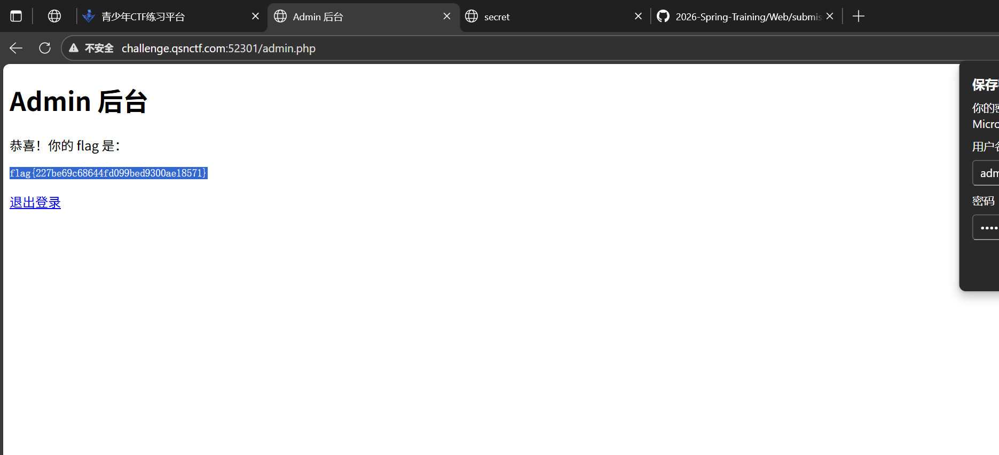
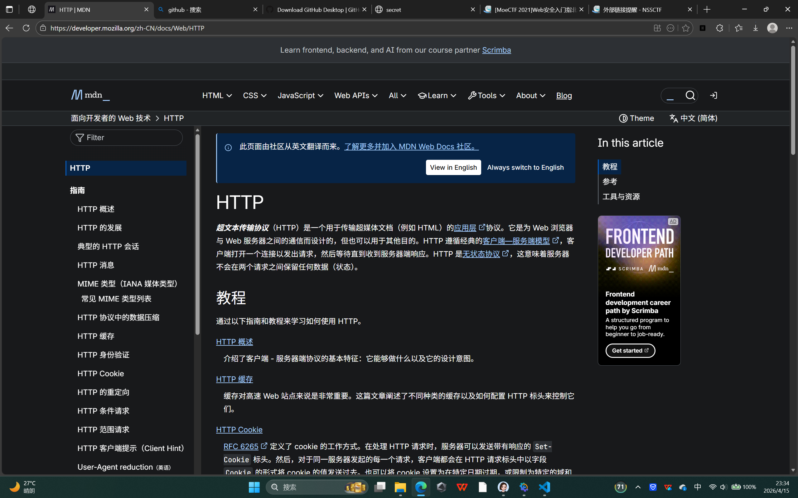
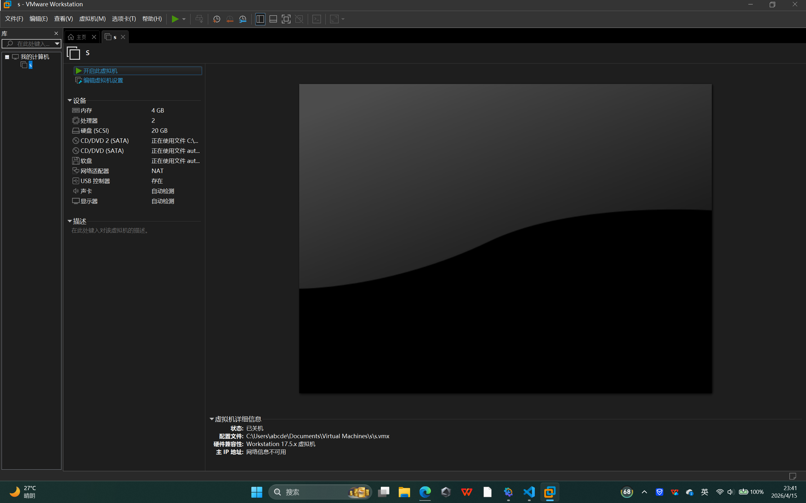
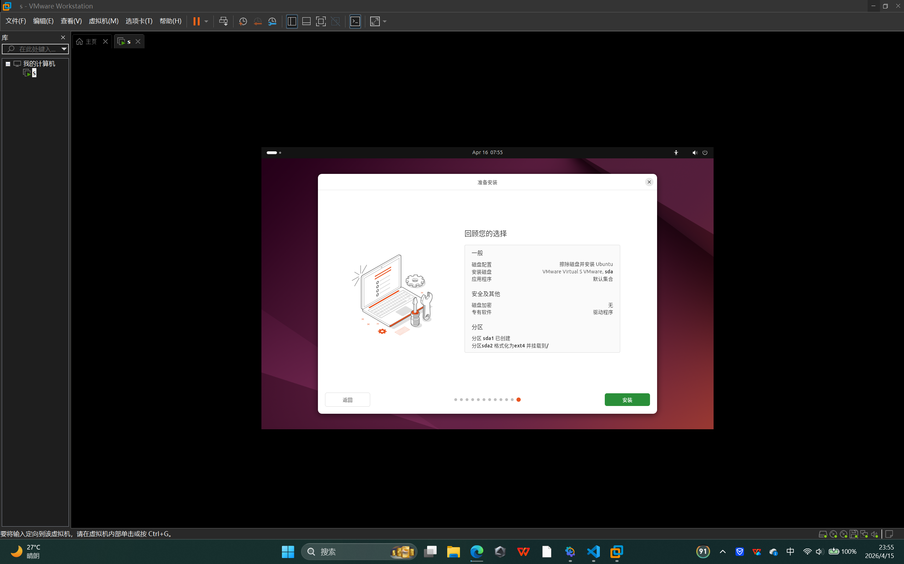

# 工具的安装和使用
## 1浏览器开发者工具/Hackbar

之前寒假培训下的
## 2 Burp Suite

## 3 AI

## 4 dirsearch

下了不会用
# 题目
## 1 [SWPUCTF 2021 新生赛]gift_F12 

## 2 [qsnctf-NO.0902]robots.txt

## 3 

# Linux 理论基础
## 环境搭建

## 基础知识学习
一、目录与文件操作（最常用）
pwd：查看当前所在路径
ls：列出目录内容
ls -l：详细列表
ls -a：显示隐藏文件
cd 目录名：进入目录
cd ..：返回上一级
cd ~：回到家目录
mkdir 目录名：新建文件夹
rm 文件名：删除文件
rm -r 目录名：删除文件夹
cp 源 目标：复制
mv 源 目标：移动 / 重命名
二、文件查看与编辑
cat 文件名：直接查看文件内容
less 文件名：分页查看
head 文件名：看前 10 行
tail 文件名：看后 10 行
touch 文件名：新建空文件
nano 文件名：简单编辑（Ctrl+O 保存，Ctrl+X 退出）
三、权限与用户
chmod 777 文件：改权限
whoami：查看当前用户
id：查看用户信息
sudo 命令：以管理员权限执行
四、搜索与查找
grep "关键词" 文件：在文件里找文字
find 路径 -name 文件名：查找文件
五、网络与 URL 相关
curl 网址：访问网页并输出内容
wget 网址：下载文件
ifconfig/ip addr：查看网卡
六、压缩解压
tar zxvf 文件名.tar.gz：解压
tar zcvf 包名 目录：压缩
七、CTF 必背 5 条
cat flag.txt 看 flag
ls 找文件
cd 进目录
grep flag * 全局搜 flag
curl 访问网页拿 flag